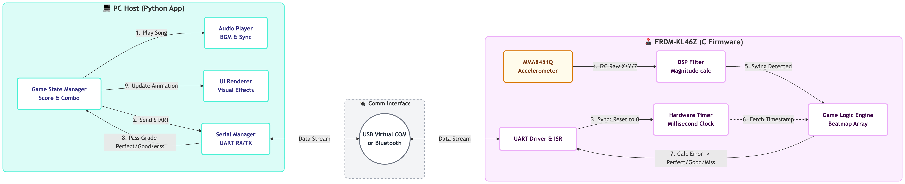
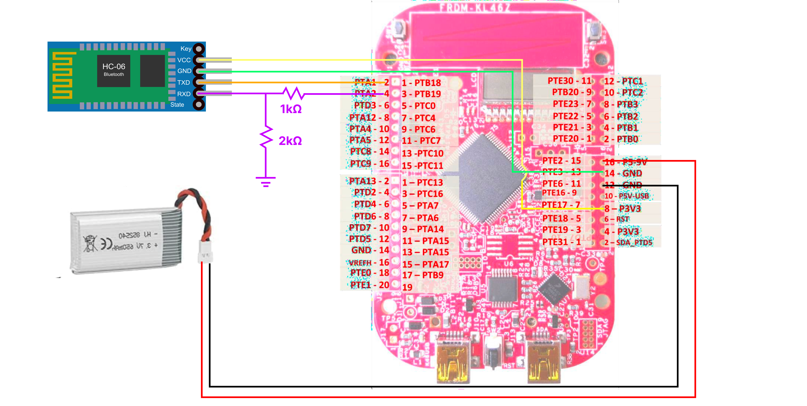

# ECE3140 page for ff267 yz2788!

# 💃🕺🪩 Shake It Up! 🪩🕺💃

     
    <!-- <em>Project main image: Shake It Up!</em> -->

## Introduction 

Our project implements a rhythm-based interactive game called “Shake It Up!” using the FRDM-KL46Z board. The system uses the onboard MMA8451Q accelerometer to track a player’s motion and determine whether their movements match the timing of a music track, providing feedback such as “PERFECT,” “GOOD,” or “MISS” through a Python interface on a computer. Inspired by games like Just Dance, we explored how a low-cost embedded system can perform motion sensing and basic gesture recognition without cameras or external sensors. The board handles real-time processing by sampling acceleration data via I2C, computing motion magnitude to detect deliberate movements, and sending processed results to the host computer over UART for visualization and scoring. We successfully built a working prototype that detects motion and synchronizes it with external feedback. Through this project, we learned how to integrate sensing, real-time processing, and communication in an embedded system, and gained experience debugging and organizing code across both embedded C and Python.

## System Overview 

     
    <em>Figure 1: System architecture overview</em>

<!-- - Include a flow chart/block diagram of the system, showing how components interact. This diagram could potentially be replaced by \textit{very} clear writing.
- Please fill this in by the project check-in date (Apr 21st)   -->
<!-- - Video: After the overview is a good place to embed the video. The video is not required by the check-in date.  -->

## System Description 

 Our system consists of two main components: the FRDM-KL46Z board for sensing and real-time processing, and a Python interface on a computer for visualization and feedback. On the embedded side, we use the onboard MMA8451Q accelerometer, which communicates with the microcontroller over I2C. The board samples 3-axis acceleration data at a fixed rate using a PIT timer interrupt.
The accelerometer data is processed directly on the board. We compute the magnitude of the acceleration vector to detect deliberate movements. Once a gesture is detected, the board formats the result and transmits it to the computer using UART, either through USB or an HC-06 Bluetooth module for wireless communication.

     
    <em> Figure 2: Hardware Schematic </em>

On the computer side, a Python program reads the incoming serial data and synchronizes it with a music track. Based on the timing of the detected movements relative to the music, the program assigns feedback such as “PERFECT,” “GOOD,” or “MISS” and displays it through a GUI. The embedded system focuses on real-time sensing and computation, while the computer handles timing evaluation, visualization, and user interaction.

<!-- - Explain how your system/software works. This should be at an appropriate level of detail to allow us to evaluate design decisions. Feel free to include code snippets where appropriate. Projects with additional hardware must include a schematic.
- Please upload a draft of this text/schematic by the project check-in date (Apr 21st)  -->

## Testing 

### Accelerometer and Gesture Recognition
* Print out raw X, Y, and Z acceleration values from the MMA8451Q sensor to the console to ensure data is being read correctly.
* Test manual interaction by waving the board in four directions (Up, Down, Left, Right) to verify if the movements are distinguishable.
* Adjust threshold parameters in the C code so that intentional waves are recognized while minor hand tremors or idle noise are filtered out.
* Fine-tune the gesture detection logic to ensure a single wave is recognized as one distinct input instead of multiple rapid triggers.

### Bluetooth Communication and Signal Stability
* Verify successful pairing between the HC-06 Bluetooth module and the PC to establish a stable wireless data link.
* Use the demo.ipynb environment to specifically test if "Up, Down, Left, Right" motions performed on the board are accurately captured over the Bluetooth connection.
* Test the effective range of the Bluetooth signal to ensure player movements do not cause data packets to drop during active gameplay.
* Monitor serial output on the Python side to evaluate any latency introduced by the wireless transmission compared to a wired UART connection.

### Python and GUI: Interaction and Synchronization
* Test the game's responsiveness by letting Python generate random directional signals (Up, Down, Left, Right) and manually performing the corresponding movements to check for sync.
* Verify that the game's visual assets (up.png, down.png, left.png, right.png) and feedback sprites (perfect.png, good.png, miss.png) are loaded and displayed in the correct positions.
* Test different gameplay scenarios (perfect, good, and miss) to ensure the score updates in real-time and the "Final Score" and "Max Combo" are displayed accurately upon exiting.
* Confirm that the movement on the board and the animation on the screen are synchronized without noticeable latency, providing a smooth experience.

## Resources
- Cite the resources you used for this project. If this is based on another codebase, link it here. If you did not use any other code, please still include this section and state that you did everything from scratch. 

## Work Distribution
<!-- - Describe how you worked together, and who did what. If you encountered difficulties, then how did you deal with them? -->

The initial planning and system architecture were completed collaboratively by both of us. While Yihan focused on developing the DSP filtering, MMA8451 driver, and the Python GUI, Felicia focused on the hardware connections, game logic firmware, and the Bluetooth HC-06 integration, we helped modify each other’s code and setup whenever one encountered a problem. We met frequently to debug and test the human interaction elements together. Each of us has a solid understanding of every aspect of the project and contributed an equal amount of work to the final system.

## AI Usag
We utilized Generative AI to produce our visual assets. This included generating the game background, the directional arrows (up.png, down.png, left.png, right.png), and the real-time performance signals (perfect.png, good.png, miss.png) used for user feedback.
